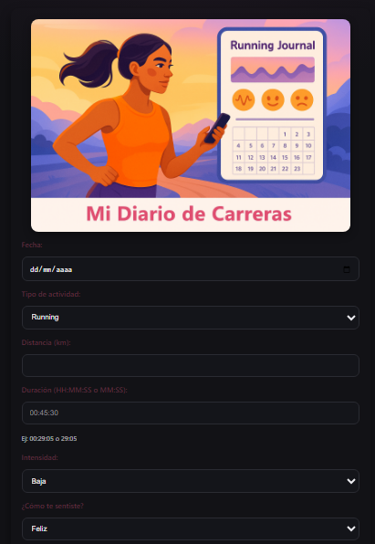
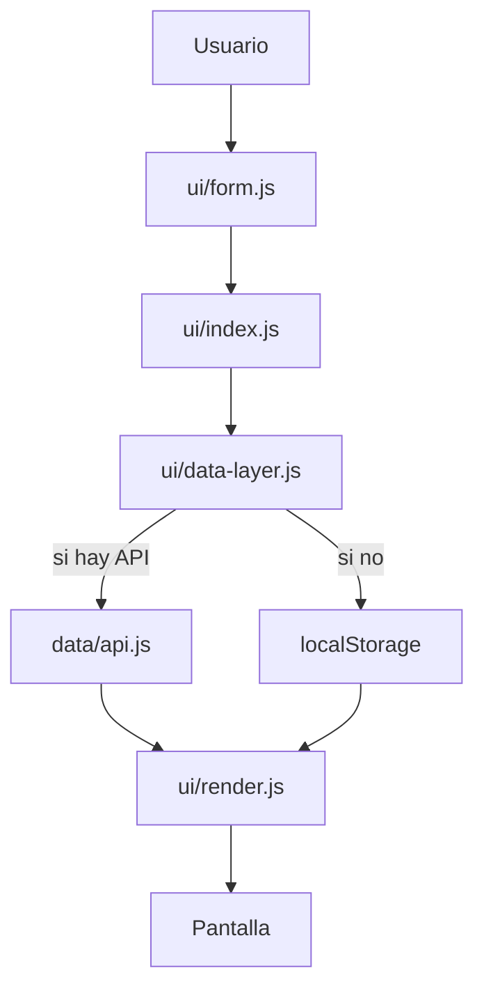

<h1 align="center">🏃‍♀️ Mi Diario de Carreras</h1>

<p align="center">
  <em>Proyecto Final - Tecnicatura en Programación (TECLAB)</em><br>
  Aplicación web para registrar entrenamientos, emociones, alimentación y fases del ciclo menstrual,<br>
  con almacenamiento local o conexión a una API en MySQL.
</p>

<p align="center">
  🔗 <b>Versión online:</b><br>
  <a href="https://barbyland.github.io/mi-diario-de-carreras/" target="_blank">
    https://barbyland.github.io/mi-diario-de-carreras/
  </a>
</p>

<p align="center">
  
</p>


## ✨ Funcionalidades

**Registro de entrenamientos**
- 📅 fecha (YYYY-MM-DD)
- 🏃 tipo (Running, Bicicleta, Caminata, Otra)
- 📏 distancia (km)
- ⏱️ duración (HH:MM:SS o MM:SS)
- 🔥 intensidad (Baja, Media, Alta)
- 🙂 sentimiento (Feliz, Cansada, etc.)
- ♀️ ciclo_menstrual (Folicular, Ovulatoria, Lútea, Menstrual) – opcional
- 🍌 alimentacion_previa (texto) – opcional
- 📝 comentarios

**Lista de registros con**
- ✅ chips de colores por intensidad, sentimiento y ciclo
- 🧮 cálculo automático del pace (min/km)
- 📊 resumen de total de km y cantidad de entradas
- ✏️ edición con modo inline
- 🗑️ eliminación

**Persistencia**
- 💾 localStorage (modo demo, sin servidor)
- 🌐 API real (Express + MySQL) si está disponible

---

## 🧱 Estructura del proyecto

```plaintext
.
├── index.html
├── style.css
├── README.md
│
├── helpers/
│   └── utils.js              # helpers reutilizables (fecha, pace, etc.)
│
├── data/
│   └── api.js                # capa HTTP cruda: fetch a API Express
│
├── ui/
│   ├── data-layer.js         # decide origen: API real o LocalStorage fallback
│   ├── form.js               # lógica del formulario: leer/validar/llenar/editar
│   ├── render.js             # render del listado + resumen + chips
│   └── index.js              # “pegamento”: conecta UI, data y render
│
└── server/                   # backend Node + Express (opcional)
    ├── server.js
    ├── db-mysql.js
    └── sql/
        ├── 001_schema.sql    # CREATE DATABASE/TABLE
        ├── 002_seed.sql      # datos iniciales
        └── 003_queries.sql   # consultas útiles

---
```
🔄 Flujo de la UI

____________________________________________________________________________________
▶️ Cómo ejecutar (solo front)

1. Abrir el proyecto en VS Code.

2. Usar Live Server o abrir index.html directamente en el navegador.

3. Registrar entrenamientos desde el formulario.

4. Los datos se guardan automáticamente en localStorage.

____________________________________________________________________________________

🗄️ Usar con API real (Express + MySQL)

1. Tener MySQL corriendo y crear BD/tablas con:

server/sql/001_schema.sql

server/sql/002_seed.sql

2. Configurar credenciales en db-mysql.js:

MYSQL_HOST, MYSQL_PORT, MYSQL_USER, MYSQL_PASS, MYSQL_DB


3. Instalar dependencias y levantar servidor:

cd server
npm install
node server.js

4. Endpoints disponibles:

GET /api/entrenamientos

POST /api/entrenamientos

PUT /api/entrenamientos/:id

DELETE /api/entrenamientos/:id

En index.html ya está configurado:

<script>window.API_BASE = 'http://localhost:3000/api';</script>


👉 Si la API responde, la UI muestra “Origen de datos: API (entrenamientos)”.
👉 Si no, cae automáticamente a LocalStorage.
_____________________________________________________________________________________
🧪 Consistencia de nombres

Todos los campos viajan con los mismos nombres en HTML → UI → API → BD:

fecha, tipo, distancia_km, duracion, intensidad,
sentimiento, ciclo_menstrual, alimentacion_previa, descripcion
______________________________________________________________________________________

🧩 Buenas prácticas aplicadas

✔️ Separación clara por capas

✔️ Comentarios y secciones

✔️ Fallback seguro a localStorage

✔️ API REST limpia y consistente

✔️ Integración de variables deportivas específicas (alimentación, ciclo menstrual)
_______________________________________________________________________________________
🚀 Próximos pasos

🔜 Filtros por fecha y tipo

🔜 Exportar a CSV

🔜 Gráficos de evolución

---


<p align="center">
  Desarrollado con 💻 y pasión por <b>Barby Bernhard</b><br>
  <em>Lic. en Turismo | Técnica Superior en Programación (TECLAB) | Runner & Cyclist 🏃‍♀️🚴‍♀️</em><br><br>
  <em>Proyecto Final aprobado en la Práctica Profesionalizante del Instituto Técnico Superior Teclab.</em><br><br>
  🌐 <a href="https://github.com/Barbyland" target="_blank">GitHub</a> |
  💼 <a href="https://www.linkedin.com/in/barbara-bernhard/" target="_blank">LinkedIn</a>
</p>

