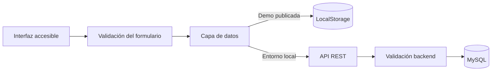

<h1 align="center">🏃‍♀️ Mi Diario de Carreras</h1>

<p align="center">
  Aplicación web para registrar entrenamientos y relacionar rendimiento, emociones,
  alimentación y fases del ciclo menstrual.
</p>

<p align="center">
  <a href="https://barbyland.github.io/mi-diario-de-carreras/"><strong>Ver demo</strong></a>
  ·
  <a href="https://github.com/Barbyland/mi-diario-de-carreras/actions"><strong>GitHub Actions</strong></a>
</p>

<p align="center">
  
</p>

## Descripción

Mi Diario de Carreras es el proyecto final de la Práctica Profesionalizante de la
Tecnicatura Superior en Programación de TECLAB. Permite crear, consultar, editar y
eliminar entrenamientos, calcular el ritmo por kilómetro y registrar variables que
pueden influir en el rendimiento.

La aplicación ofrece dos modos de persistencia:

- **Demo pública:** utiliza `localStorage`; cada visitante conserva sus datos únicamente en su navegador.
- **Entorno full-stack local:** utiliza una API REST con Node.js, Express y MySQL.

> La demo de GitHub Pages no envía información a un servidor ni comparte registros entre dispositivos.

## Funcionalidades

- Registro de fecha, actividad, distancia, duración e intensidad.
- Cálculo automático del pace en `min/km`.
- Estado emocional, alimentación previa y fase del ciclo menstrual.
- Edición y eliminación con confirmación explícita.
- Resumen de kilómetros y cantidad de sesiones.
- Persistencia automática en `localStorage` o MySQL.
- Diseño responsive, modo oscuro y navegación mediante teclado.
- Validación de datos tanto en frontend como en backend.

## Tecnologías

| Capa | Tecnologías |
| --- | --- |
| Frontend | HTML5 semántico, CSS3, JavaScript ES Modules |
| Persistencia demo | Web Storage API (`localStorage`) |
| Backend | Node.js, Express, API REST |
| Base de datos | MySQL, `mysql2` y scripts SQL |
| Calidad | Node Test Runner, `npm audit`, GitHub Actions |

## Arquitectura


```mermaid
flowchart LR
  UI[Interfaz accesible] --> FORM[Validación del formulario]
  FORM --> DL[Capa de datos]
  DL -->|Demo publicada| LS[(LocalStorage)]
  DL -->|Entorno local| API[API REST]
  API --> VALID[Validación backend]
  VALID --> DB[(MySQL)]
```

```text
.
├── index.html                 # estructura semántica de la aplicación
├── style.css                  # diseño responsive y modo oscuro
├── data/api.js                # cliente HTTP y healthcheck
├── helpers/utils.js           # fecha, duración y cálculo de pace
├── ui/
│   ├── data-layer.js          # selección API o localStorage
│   ├── form.js                # formulario, validación y edición
│   ├── index.js               # coordinación de la interfaz
│   └── render.js              # render seguro mediante textContent
├── server/
│   ├── db-mysql.js            # consultas parametrizadas
│   ├── server.js              # rutas y manejo de errores
│   ├── validation.js          # contrato de datos de la API
│   ├── sql/                   # esquema, datos de ejemplo y consultas
│   └── test/                  # pruebas del backend
├── tests/                     # pruebas de utilidades frontend
└── .github/workflows/ci.yml   # validación continua
```

## Ejecutar la demo local

Los módulos ES necesitan un servidor HTTP; no conviene abrir `index.html` directamente.

```bash
python -m http.server 5500 --bind 127.0.0.1
```

Abrí `http://127.0.0.1:5500/`. Si necesitás forzar el modo demo:

```text
http://127.0.0.1:5500/?mode=local
```

## Ejecutar con Express y MySQL

### 1. Crear la base de datos

Ejecutá en MySQL, en este orden:

```text
server/sql/001_schema.sql
server/sql/002_inserts.sql   # opcional: datos de ejemplo
```

### 2. Configurar variables de entorno

Dentro de `server/`, copiá `.env.example` como `.env` y reemplazá los valores de ejemplo:

```env
MYSQL_HOST=localhost
MYSQL_PORT=3306
MYSQL_USER=root
MYSQL_PASS=tu_password_local
MYSQL_DB=mi_diario_carreras
PORT=3000
CORS_ORIGIN=http://127.0.0.1:5500,http://localhost:5500
```

El archivo `.env` está ignorado por Git y nunca debe publicarse.

### 3. Instalar y levantar la API

```bash
cd server
npm ci
npm start
```

Luego iniciá el frontend en el puerto `5500`. Si la API responde en
`http://localhost:3000/api/health`, la interfaz cambia automáticamente a `API + MySQL`.

## Endpoints

| Método | Endpoint | Acción |
| --- | --- | --- |
| `GET` | `/api/health` | Estado de la API y MySQL |
| `GET` | `/api/entrenamientos` | Lista paginada |
| `GET` | `/api/entrenamientos/:id` | Detalle de una sesión |
| `POST` | `/api/entrenamientos` | Crear una sesión |
| `PUT` | `/api/entrenamientos/:id` | Actualizar una sesión |
| `DELETE` | `/api/entrenamientos/:id` | Eliminar una sesión |

El archivo [`api.http`](api.http) incluye solicitudes de ejemplo para VS Code REST Client.

## Pruebas y controles

```bash
npm test
npm run check
npm audit --omit=dev --prefix server
```

La integración continua ejecuta:

- validación de sintaxis;
- pruebas de duración, pace y fechas;
- pruebas del contrato de la API;
- auditoría de dependencias de producción.

## Seguridad aplicada

- Credenciales exclusivamente mediante variables de entorno.
- Consultas SQL parametrizadas.
- Restricción configurable de orígenes CORS.
- Límite para cuerpos JSON y validación de longitudes.
- Política de Seguridad de Contenido en el frontend.
- Render de datos mediante `textContent` para impedir XSS almacenado.
- Mensajes de error del servidor sin exponer detalles internos.

## Mejoras futuras

- Autenticación y separación de datos por usuario.
- Filtros por actividad y rango de fechas.
- Gráficos de evolución y exportación CSV.
- Pruebas de integración de la API con una base temporal.
- Despliegue independiente del backend y MySQL.

## Autora

**Barbara Bernhard** — Licenciada en Turismo y Técnica Superior en Programación.

- [GitHub](https://github.com/Barbyland)
- [LinkedIn](https://www.linkedin.com/in/barbara-bernhard/)

Proyecto final aprobado en la Práctica Profesionalizante del Instituto Técnico Superior TECLAB.
